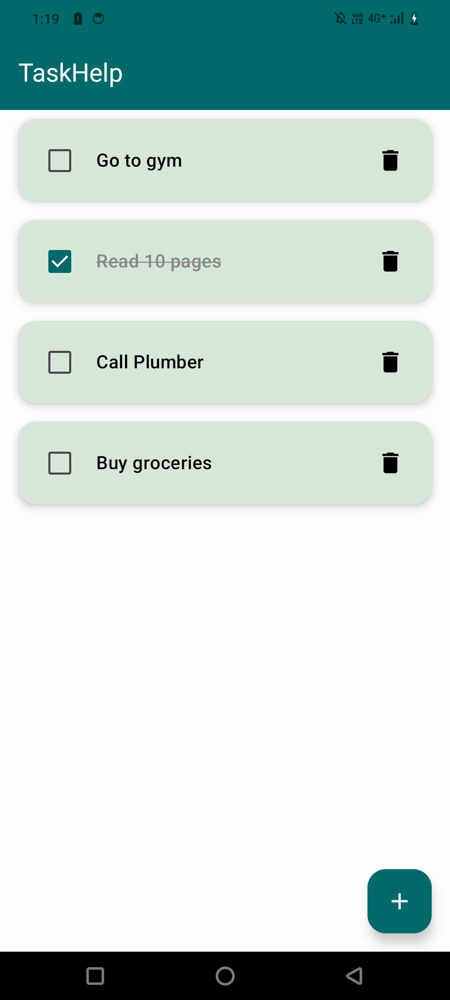
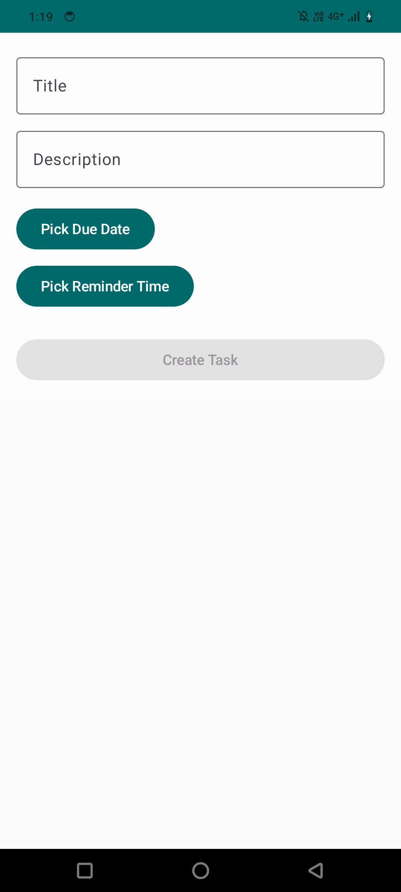

# TaskHelp – Task Manager App

**TaskHelp** is a modern, lightweight Android To-Do list app built using Jetpack Compose, Hilt, Room, and WorkManager.  
It lets users quickly add tasks, set due dates, and receive timely reminders.

---

## Features

- Add and delete tasks
- Set due date and reminder time
- Get local notifications using WorkManager
- Expandable task UI with smooth animations
- Built with clean MVVM + DI architecture

---

## Screenshots

| Home (Collapsed) | Home (Expanded) | Create Task |
|------------------|------------------|--------------|
|  |  |  |


---

## Tech Stack

- Jetpack Compose
- Room Database
- Hilt for Dependency Injection
- WorkManager for task reminders
- Kotlin Coroutines and StateFlow

---

## APK

You can [download the latest APK here](apk/taskhelp.apk).  
To install manually:
```bash
adb install taskhelp.apk
